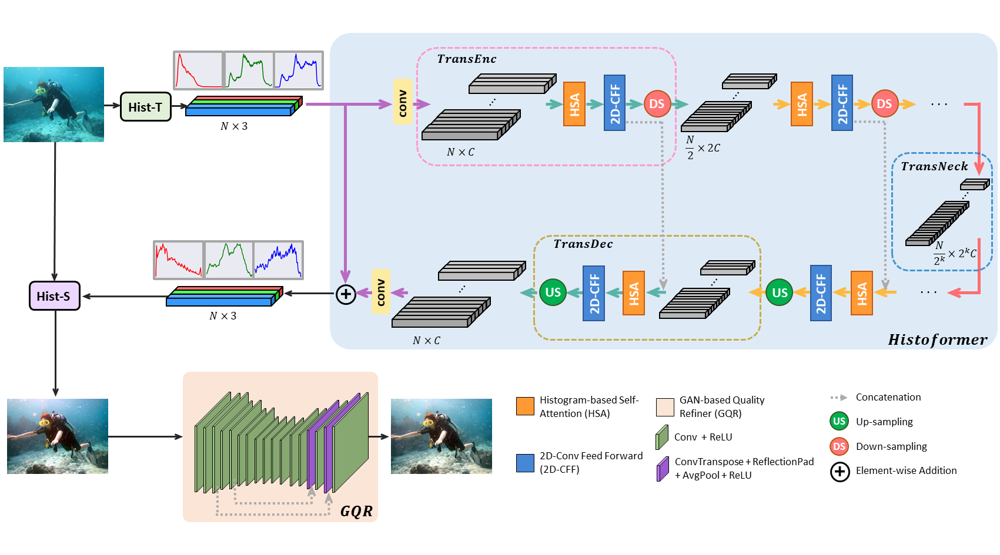

# Histoformer-Histogram-based Transformer for Efficient Underwater Image Enhancement, IEEE Journal of Oceanic Engineering, 2024
Pytorch Implementation of Histoformer-Histogram-based Transformer for Efficient Underwater Image Enhancement

## Abstract
When taking images underwater, we often find them to have low contrast and color distortions since light passing through water suffers from absorption, scattering, and attenuation, making it difficult to see the scene clearly. To address this, we propose an effective model for underwater image enhancement using a histogram-based transformer (Histoformer), learning histogram distributions of high-contrast and color-corrected underwater images to produce the desired histogram to improve the visual quality of underwater images. Furthermore, we integrate Histoformer with a generative adversarial network for pixel-based quality refinement. Experimental results demonstrate that the proposed model performs favorably against state-of-the-art underwater image restoration and enhancement approaches objectively and subjectively.

## Architecture of Histoformer


## Environment Requirements
1. Create a virtual environment using `virtualenv`.
    ```
    virtualenv -p python3 venv
    ```
2. Install the package. (The version may vary depending on your device.)
    ```
    source venv/bin/activate
    pip install -r requirements.txt
    ```
## Testing
*  Pretrained models : from *[[Histoformer](http://gofile.me/65TdH/4hIJdYPnT)]* and place it in ./checkpoints <br>

    ```
    python test.py
    ```
    
*  Change the `"get_test_set"` in test.py. <br>

## Training

```
python train.py
 ```
    
*  Change the `"get_training_set"` in train.py. <be>

## Dataset
*  [UW800](https://drive.google.com/file/d/1EIShSzhcYmmb4_mWmw9oFOIEMtsGlFk8/view)

UW800 
## Results presentation

